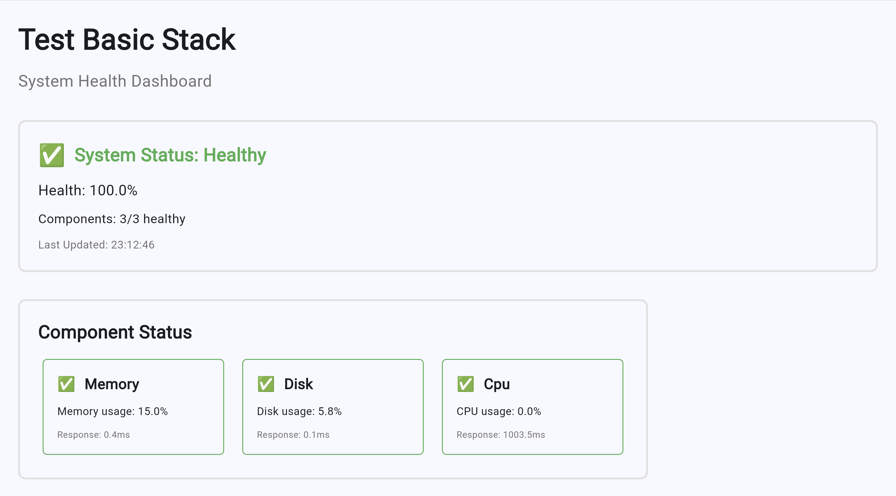

# Frontend Component

The **Frontend Component** provides the user interface for your Aegis Stack application using [Flet](https://flet.dev/) - a Python-native framework for building web, desktop, and mobile apps by Feodor Fitsner.

## Basic Usage

Create your UI components in the frontend module:

```python
# app/components/frontend/main.py
import flet as ft
from app.services.data_service import get_dashboard_stats

def create_frontend_app():
    """Create and return Flet session handler"""
    
    async def main(page: ft.Page):
        page.title = "My Aegis App"
        page.theme_mode = ft.ThemeMode.LIGHT
        
        # Data display
        data_view = ft.Text("Loading...", size=16)
        
        async def load_data(e):
            data = await get_dashboard_stats()
            data_view.value = f"Records: {data['count']}"
            page.update()
        
        # Simple dashboard
        page.add(
            ft.Text("Dashboard", size=24, weight=ft.FontWeight.BOLD),
            ft.ElevatedButton("Load Data", on_click=load_data),
            data_view
        )
    
    return main
```

## Integration with Backend

The frontend integrates with your FastAPI backend through the application composition:

```python
# app/integrations/main.py
import flet.fastapi as flet_fastapi
from app.components.frontend.main import create_frontend_app

# Mount Flet app on FastAPI
session_handler = create_frontend_app()
flet_app = flet_fastapi.app(session_handler)
app.mount("/dashboard", flet_app)
```

## Configuration

Flet runs through the backend container and is accessible at `http://localhost:8000/dashboard` during development.

## System Health Dashboard

The Frontend Component includes a production-ready **System Health Dashboard** that showcases Flet's capabilities:



This dashboard demonstrates:

- **Real-time data integration** with backend APIs
- **Responsive component layout** with automatic updates
- **Rich visual components** including status cards and progress indicators
- **Cross-platform compatibility** - same code runs everywhere

## Technology Integration

The Frontend Component leverages [Flet](https://flet.dev/), created by Feodor Fitsner - a revolutionary approach to Python UI development that offers:

### Flet's Innovation
- **Python-native** - Write UI code entirely in Python, no HTML/CSS/JavaScript required
- **Cross-platform** - Same code runs as web app, desktop app, or mobile app
- **Real-time updates** - Changes reflect immediately without page refreshes
- **Rich controls** - Modern UI components with built-in theming and animations
- **Flutter foundation** - Built on Google's Flutter, inheriting its performance and polish

### Integration Advantages
- **[FastAPI integration](https://flet.dev/docs/guides/python/deploying-web-app/fastapi)** - Seamless mounting on existing FastAPI applications
- **Async support** - Natural async/await patterns for backend API calls
- **Type safety** - Full Python type checking for UI logic
- **Shared codebase** - Frontend and backend share the same Python environment

Flet was selected because it eliminates the traditional frontend/backend split, allowing Python developers to build complete applications without leaving their language expertise.

## Next Steps

- **[Flet Documentation](https://flet.dev/docs/)** - Complete UI framework capabilities
- **[Flet Controls Gallery](https://flet.dev/docs/controls/)** - Available UI components  
- **[Component Overview](./index.md)** - Understanding Aegis Stack's component architecture
- **[Philosophy Guide](../philosophy.md)** - Component architecture principles