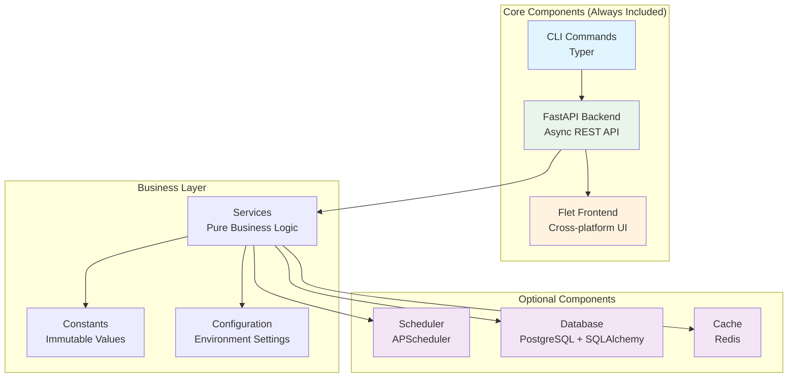

# Components Overview

Components are the building blocks of your Aegis Stack application. Each component provides a specific capability like API serving, background tasks, or data persistence.

> 💡 **New to Aegis Stack?** See the [Philosophy Guide](../philosophy.md) for the complete component design principles.

## Component Selection

**⚠️ Important:** Components must be selected during project creation. There is currently no way to add components to existing projects.

```bash
# Basic stack (FastAPI + Flet)
aegis init my-project

# Add scheduler capability
aegis init my-project --components scheduler

# Multiple components (future)
aegis init my-project --components scheduler,database,cache
```

## Component Architecture



## Available Components

| Component | Purpose | Implementation | Status |
|-----------|---------|----------------|--------|
| **Core** (Backend + Frontend + CLI) | API + UI + Management | [FastAPI](https://fastapi.tiangolo.com/) + [Flet](https://flet.dev/) + [Typer](https://typer.tiangolo.com/) | ✅ Always included |
| **[Scheduler](./scheduler.md)** | Background tasks, cron jobs | [APScheduler](https://apscheduler.readthedocs.io/) | ✅ Available |
| **Database** | Data persistence, migrations | [PostgreSQL](https://postgresql.org/) + [SQLAlchemy](https://sqlalchemy.org/) | 🚧 Coming soon |
| **Cache** | Session storage, performance | [Redis](https://redis.io/) | 🚧 Coming soon |

### Technology Integration

Each component integrates proven open-source technologies:

- **Backend**: [FastAPI](https://fastapi.tiangolo.com/) provides async web serving with automatic API documentation
- **Frontend**: [Flet](https://flet.dev/) enables Python-native cross-platform UI development  
- **CLI Integration**: [Typer](https://typer.tiangolo.com/) creates command-line interfaces that hook directly into your Python logic
- **Monitoring**: [Rich](https://rich.readthedocs.io/) provides terminal formatting for CLI commands and health displays
- **System Monitoring**: [psutil](https://psutil.readthedocs.io/) enables cross-platform system health monitoring

Components are designed as **capability interfaces** - the current implementations can be replaced with alternatives while maintaining the same component API.

## Next Steps

- **[Backend Component](./webserver.md)** - FastAPI backend configuration
- **[Frontend Component](./frontend.md)** - Building user interfaces with Flet  
- **[Scheduler Component](./scheduler.md)** - Scheduling and cron job system
- **[Philosophy Guide](../philosophy.md)** - Component design principles and architecture