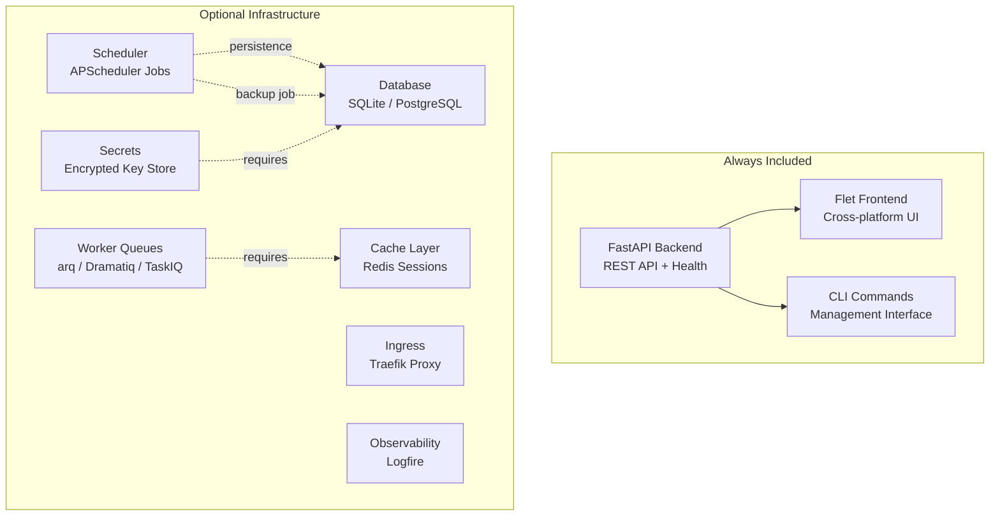
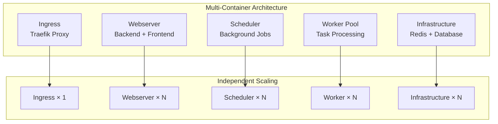

# Components Overview

Components are the **infrastructure building blocks** of your Aegis Stack application. Each component provides a specific capability like API serving, background tasks, or data persistence.

!!! info "Components vs Services"
    **Components** = Infrastructure capabilities (database, workers, scheduling)
    **Services** = Business functionality (auth, AI, comms, insights)

    See **[Services Overview](../services/index.md)** for business-level features.

## Evolving Your Stack

**Your choices aren't permanent.** Components can be added or removed as your requirements change.

Unlike most starters that lock you in at `init`, Aegis Stack lets you evolve:

- **Add components**: `aegis add scheduler --project-path ./my-api`
- **Remove components**: `aegis remove scheduler --project-path ./my-api`
- **Update templates**: Stay current with upstream improvements

For complete workflows with real-world examples, see **[Evolving Your Stack →](../evolving-your-stack.md)**

## Component Architecture

```mermaid
graph TB
    subgraph "Always Included"
        API["FastAPI Backend<br/>REST API + Health"]
        Frontend["Flet Frontend<br/>Cross-platform UI"]
        CLI["CLI Commands<br/>Management Interface"]
    end
    
    subgraph "Optional Infrastructure"
        Scheduler["Scheduler<br/>APScheduler Jobs"]
        Database["Database<br/>SQLite / PostgreSQL"]
        Worker["Worker Queues<br/>arq / Dramatiq / TaskIQ"]
        Ingress["Ingress<br/>Traefik Proxy"]
        Observability["Observability<br/>Logfire"]
        Cache["Cache Layer<br/>Redis Sessions"]
        Secrets["Secrets<br/>Encrypted Key Store"]
    end
    
    API --> Frontend
    API --> CLI
    
    Scheduler -.->|persistence| Database
    Worker -.->|requires| Cache
    Scheduler -.->|backup job| Database
    Secrets -.->|requires| Database
```

## Component Deployment

Understanding how components deploy and scale is crucial for architectural decisions:

```mermaid
graph TB
    subgraph "Multi-Container Architecture"
        A0["Ingress<br/>Traefik Proxy"]
        A1["Webserver<br/>Backend + Frontend"]
        A2["Scheduler<br/>Background Jobs"]
        A3["Worker Pool<br/>Task Processing"]
        A4["Infrastructure<br/>Redis + Database"]
    end

    subgraph "Independent Scaling"
        B0[Ingress × 1]
        B1[Webserver × N]
        B2[Scheduler × N]
        B3[Worker × N]
        B4[Infrastructure × N]
    end

    A0 --> B0
    A1 --> B1
    A2 --> B2
    A3 --> B3
    A4 --> B4
```

**Multi-Container Architecture:** Each component runs in its own Docker container (via docker-compose) for isolation and maintainability.

**Backend + Frontend Container:** FastAPI serves the Flet UI as an integrated web app - this is an architectural choice, not a limitation.

**Independent Scaling:** Each service can be scaled separately based on demand using Docker Compose replicas or orchestration tools.

!!! tip "Component Composition"
    Components can be combined to enable different capabilities. For detailed patterns on how components integrate with services and each other, see the **[Integration Patterns Reference](../integration-patterns.md)**.

**Individual components combine to form your complete application.** Database + Scheduler + Worker + Auth + AI = A unified, production-ready system.
