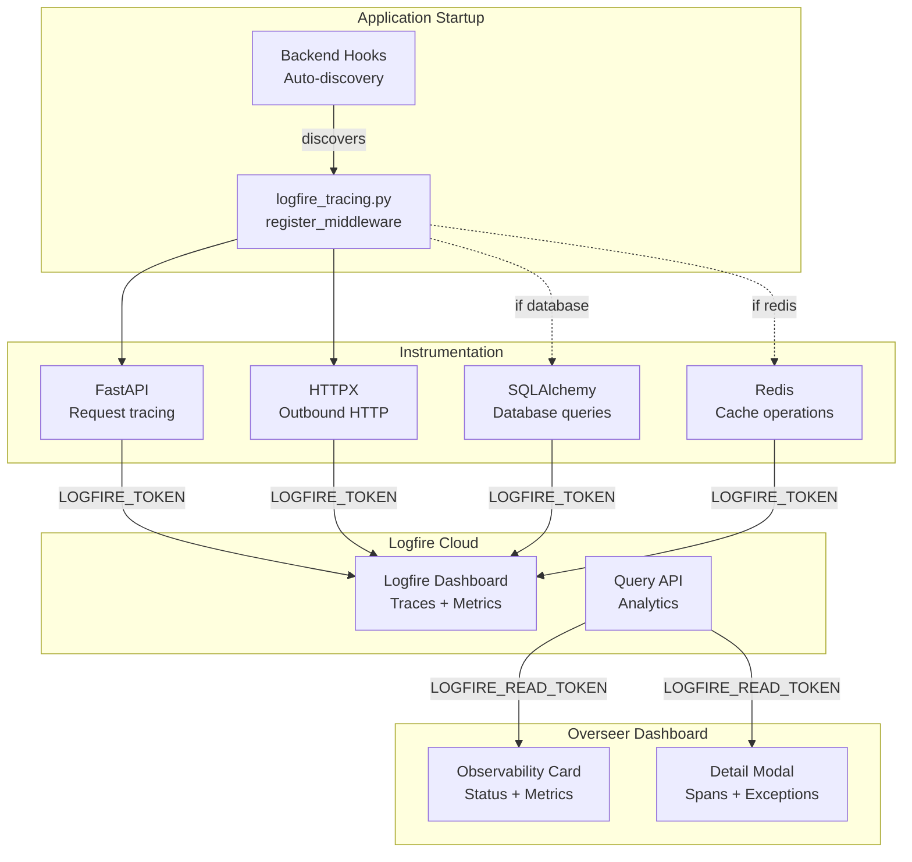

# Observability Component

!!! example "Musings: On Observability in Overseer (March 21st, 2026)"
    This is a weird one. I don't see this as a true replacement for the Logfire UI, but they do give enough useful info to warrant a spot in Overseer. I just have to find the balance.


Distributed tracing, metrics, and log correlation with [Pydantic Logfire](https://logfire.pydantic.dev/). Auto-instruments your application and adapts to whichever components you have enabled.

!!! info "Adding Observability to Your Project"
    ```bash
    aegis init my-project --components observability
    aegis add observability    # for existing projects
    ```

## What Observability Adds

When you include the observability component, your project gets:

- **Pydantic Logfire integration** with automatic configuration
- **FastAPI instrumentation**: traces every request (health/dashboard endpoints excluded)
- **HTTPX instrumentation**: traces outbound HTTP calls
- **SQLAlchemy instrumentation**: auto-enabled when the database component is present
- **Redis instrumentation**: auto-enabled when the redis component is present
- **Health check integration** with the Overseer dashboard, including Logfire Query API analytics
- **Dashboard card + detail modal** with trace metrics, slowest spans, and exception tracking
- **Graceful degradation**: works without a cloud token (local instrumentation only)

## Generated Files

```
my-project/
├── app/
│   └── components/
│       ├── backend/
│       │   └── middleware/
│       │       └── logfire_tracing.py    # Auto-discovered Logfire middleware
│       └── frontend/
│           └── dashboard/
│               ├── cards/
│               │   └── observability_card.py   # Overseer dashboard card
│               └── modals/
│                   └── observability_modal.py  # Detail modal with tabs
└── .env.example                          # Updated with Logfire variables
```

## How It Works



The middleware is auto-discovered by the backend hook system, no manual registration needed. On startup it configures Logfire with your project name and environment, then instruments each available integration.

When `LOGFIRE_TOKEN` is set, traces are sent to Logfire cloud. Without a token, instrumentation still runs locally (useful for development and structured logging).

## Environment Variables

| Variable | Default | Description |
|------------------------|---------|-------------|
| `LOGFIRE_TOKEN` | - | Enables sending traces to Logfire cloud |
| `LOGFIRE_READ_TOKEN` | - | Enables Query API analytics in the Overseer dashboard |
| `LOGFIRE_PROJECT_URL` | - | Link to your Logfire project dashboard |

Set these in your `.env` file:

```bash
# Observability (Logfire)
LOGFIRE_TOKEN=your-write-token
LOGFIRE_READ_TOKEN=your-read-token
LOGFIRE_PROJECT_URL=https://logfire.pydantic.dev/myorg/myproject
```

## Component Integrations

Observability automatically adapts its instrumentation based on which components are enabled in your project:

| Component | Integration | What Gets Traced |
|-----------|-------------|-----------------|
| **Backend** (always) | `logfire.instrument_fastapi()` | All HTTP requests (excludes `/health/*` and `/dashboard/*`) |
| **HTTPX** (always) | `logfire.instrument_httpx()` | All outbound HTTP calls |
| **Database** | `logfire.instrument_sqlalchemy()` | SQL queries via the shared engine |
| **Redis** | `logfire.instrument_redis()` | Redis commands and pub/sub |

This is handled at template generation time, the `logfire[fastapi,httpx]` dependency automatically includes extras like `sqlalchemy` and `redis` when those components are present.

## Overseer Integration

The observability component integrates with the Overseer dashboard through a status card and a detail modal.

### Dashboard Card

The card displays real-time Logfire status:

- **With Query API** (`LOGFIRE_READ_TOKEN` set): Shows trace count, exception count, average latency, and max latency for the last hour
- **Without Query API**: Shows cloud connection status with a hint to add the read token

### Detail Modal

Clicking the card opens a detail modal with four tabs:

**Overview**, Key metrics (traces, spans, exceptions, latency) plus a bar chart of the slowest spans:


**Slowest Spans**, Full table with avg, p95, and max latency per span type, with error counts highlighted in red:


**Exceptions**, Expandable table of exceptions from the last 24 hours, grouped by type. Click to expand and see the full stack trace.

**Config**, Service name, cloud status, Query API availability, and project URL link

### Health Check

The health check queries the Logfire Query API (when `LOGFIRE_READ_TOKEN` is set) and reports:

- Total spans and traces (last hour)
- Exception count
- Average and max latency
- Top 20 slowest spans
- Recent exceptions (last 24 hours)

The three queries run one at a time, and results are cached for 10 minutes with a 5-minute backoff on failure. The cache lives in a file in the system temp directory, keyed by the read token, so a hot reload keeps it.

!!! tip "Use a read token per deployment"
    Logfire's query limits belong to the read token: every process and every project holding the same token draws from one budget, and each query scans that Logfire project's last hour of spans. Give each deployment its own Logfire project and read token, or several stacks running at once can exhaust it and the dashboard falls back to `Rate limit exceeded` errors.

## Memory Footprint on Constrained Hosts

The OpenTelemetry SDK that Logfire builds on is heavy: even with `send_to_logfire=False`, loading the SDK and its in-memory span batcher adds ~150-300 MiB of fixed overhead. On a 512 MiB container that is the difference between healthy and OOM-flapping.

Two safeguards ship in the template:

1. **No-token short-circuit.** When `LOGFIRE_TOKEN` is empty, the middleware skips `logfire.configure()` and every `instrument_*()` call. The OTEL SDK is never loaded. You see this in the logs as `Logfire: token not set, instrumentation disabled`.

2. **Bounded span buffer when the token is set.** The `BatchSpanProcessor` defaults (2048-span queue, no export timeout) leak when the Logfire endpoint is slow or unreachable, failed batches accumulate in RAM until OOM. The template caps them via four `OTEL_BSP_*` settings pushed into `os.environ` before `logfire.configure()` runs. Override via `.env` if you have headroom:

   ```ini
   # OTEL_BSP_MAX_QUEUE_SIZE=1024
   # OTEL_BSP_MAX_EXPORT_BATCH_SIZE=256
   # OTEL_BSP_EXPORT_TIMEOUT=10000
   # OTEL_BSP_SCHEDULE_DELAY=5000
   ```

### Swap on small droplets

For hosts with 4 GB RAM or less, add a 1 GB swap file as a safety net so a brief memory spike does not OOM-kill the webserver before the cgroup limit kicks in:

```bash
fallocate -l 1G /swapfile && chmod 600 /swapfile && mkswap /swapfile && swapon /swapfile
echo '/swapfile none swap sw 0 0' >> /etc/fstab
```

## Next Steps

- **[Component Overview](./index.md)**, Understanding Aegis Stack's component architecture
- **[Integration Patterns](../integration-patterns.md)**, How components work together
- **[Pydantic Logfire Documentation](https://logfire.pydantic.dev/)**, Complete Logfire reference
