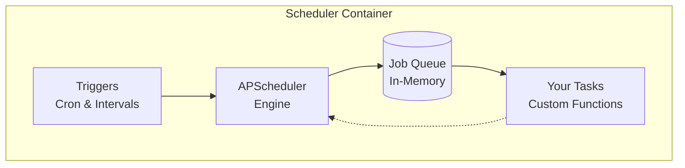

# Scheduler Component

The **Scheduler Component** provides background task scheduling and cron job capabilities using [APScheduler](https://apscheduler.readthedocs.io/).

!!! info "Memory-Based Scheduling"
    Generate a project with scheduler component and start immediately:
    
    ```bash
    aegis init my-app --components scheduler
    cd my-app
    make serve
    ```
    
    Jobs run in memory and reset on restart - perfect for development and simple deployments.

## What You Get

- **APScheduler with in-memory job storage** - Industry-standard Python scheduler
- **Cron and interval-based scheduling** - Flexible timing patterns
- **Async job execution** - Non-blocking task processing
- **Fast setup with no dependencies** - Perfect for simple recurring tasks
- **Optional extras** - Database persistence and task monitoring

## Architecture



*Jobs run in memory and reset on container restart. For persistent scheduling, see [Database Persistence](scheduler/persistence.md).*

## Adding Scheduled Tasks

### 1. Create Service Functions

Add your business logic in `app/services/`:

```python
# app/services/my_tasks.py
from app.core.log import logger

async def send_daily_report() -> None:
    """Generate and send daily reports."""
    logger.info("📊 Generating daily report")
    # Your report generation logic here
    logger.info("✅ Daily report sent successfully")

async def cleanup_temp_files() -> None:
    """Clean up temporary files."""
    logger.info("🗑️ Cleaning temporary files")
    # Your cleanup logic here
```

### 2. Schedule Your Tasks

Add an entry to `SERVICE_JOBS` in `app/components/scheduler/jobs.py`. It is
the one list of scheduled jobs; the scheduler schedules every entry.

```python
from app.services.my_tasks import send_daily_report, cleanup_temp_files

SERVICE_JOBS: tuple[ServiceJob, ...] = (
    # Daily report at 9 AM
    ServiceJob(
        send_daily_report,
        "daily_report",
        "Daily Report Generation",
        {"trigger": "cron", "hour": 9, "minute": 0},
    ),
    # Clean temp files every 4 hours
    ServiceJob(
        cleanup_temp_files,
        "temp_cleanup",
        "Temporary Files Cleanup",
        {"trigger": "interval", "hours": 4},
    ),
)
```

Each entry is scheduled with `max_instances=1`, `coalesce=True` and
`replace_existing=True`.

### Where Jobs Run

With a [worker](worker/index.md) in the project, the scheduler only produces:
each entry is scheduled as an enqueue of the job's function name onto the
`system` queue, and the worker registers the same entry as a task under that
name and runs it, with the worker's resources, retries and live feed. This
holds for arq, TaskIQ and Dramatiq alike.

- **Timeouts.** A job runs under the system queue's limit (five minutes)
  unless its entry sets `timeout` in seconds.
- **Run Now.** The dashboard button, the API
  (`POST /api/v1/scheduler/jobs/{id}/run`) and `tasks trigger` repeat the
  stored call, so a manual run is an enqueue too and never runs inside the
  webserver. The API response says where the job runs (`ran_in`).
- **Run history.** The Scheduler page times the enqueue; the job's own run
  time and outcome are on the Worker page.
- **The heartbeat stays in the scheduler**, because it proves the
  scheduler's own loop is alive.

Without a worker, the scheduler runs each job itself, and Run Now runs it in
the process that received the request. Adding a worker later moves every
entry onto it with no change to the list.

## Job Management

### Listing Jobs

```python
# Get all scheduled jobs
jobs = scheduler.get_jobs()
for job in jobs:
    print(f"Job: {job.name}, Next run: {job.next_run_time}")
```

### Modifying Jobs

```python
# Pause a job
scheduler.pause_job("daily_reports")

# Resume a job  
scheduler.resume_job("daily_reports")

# Remove a job
scheduler.remove_job("old_job_id")

# Modify job schedule
scheduler.modify_job("daily_reports", hour=7)  # Change to 7 AM
```

## Configuration

The scheduler uses APScheduler's default settings. Configuration is managed via `app/core/config.py`:

- `SCHEDULER_TIMEZONE` (str, default: `"UTC"`): IANA timezone name; cron triggers inherit this.

Code is the source of truth for job schedules. Every restart re-registers each job via `replace_existing=True`, so editing a trigger in `app/components/scheduler/jobs.py` and redeploying is all that's needed to change the schedule. Runtime edits via `scheduler.modify_job()` do not survive a restart by design.

## Best Practices

- **Keep jobs idempotent** - Safe to run multiple times
- **Use proper async patterns** - Leverage asyncio for concurrent operations
- **Handle errors gracefully** - Log failures and implement retry logic
- **Monitor execution times** - Track job performance and resource usage
- **Use descriptive job IDs** - Makes debugging and monitoring easier

## Component Evolution

**Current:** In-memory scheduling perfect for development and simple deployments

**Next:** Add database persistence for production deployments with the extras below

---

**Next Steps:**

- **[CLI Interface](scheduler/cli.md)** - Command-line task management (requires persistence)
- **[Examples](scheduler/examples.md)** - Real-world scheduling patterns and timing examples
- **[Database Persistence](scheduler/persistence.md)** - Job persistence and monitoring
- **[Component Overview](./index.md)** - How components work together
