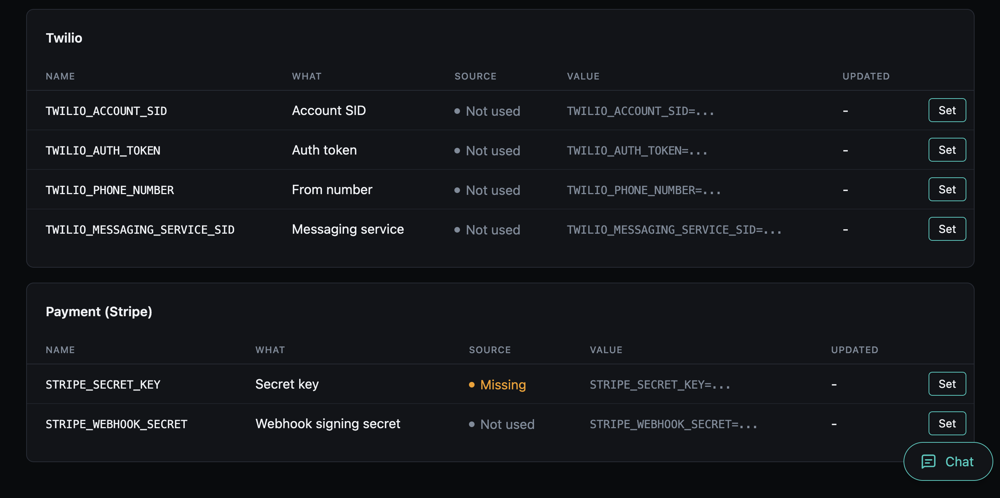

# Secrets

Every app that talks to the outside world runs on credentials: an OpenAI key, a Stripe key, an email provider's key, a Twilio token. Out of the box they live in `.env`. That works, but changing one means editing a file on the server and restarting, and nothing tells you which keys the app actually needs, which are set, or whether the one you pasted works.

The secrets component is a small credential store built into your app, the way you would store secrets in GitHub's repository settings or a password manager, but for the keys your app reads:

- **One place for every key.** Each credential the app uses is listed, grouped by what reads it (AI, email, payments), with where it is set and its last four characters.
- **Set while the app runs.** Paste a key in the Overseer dashboard, the CLI or the API, and it takes effect without a restart or a deploy.
- **Write-only.** Once saved, a key is never shown again, only its last four characters, the way a GitHub secret works.
- **Checked when you paste it.** The app makes one cheap call to the provider first, so a typo or a revoked key fails right then, not days later when a job first uses it.
- **Needed vs. optional.** Keys the app actually depends on (the AI provider you chose, your email provider) read **Missing** when unset. Providers you could add read **Not used**, so a long list of unset keys does not look like a long list of problems.
- **Encrypted at rest.** Keys are stored encrypted in your database, with a key of their own, and every change is audited (who and when, never the value).



`.env` keeps working alongside it and always wins: a key set there shows as read-only, so an existing deployment behaves exactly as before.

Today the store lives in your app's database. The component is built so that external secret managers (HashiCorp Vault, a cloud secret manager) can take its place later, behind the same screens and commands (see [Backends](how-it-works.md#backends)).

## Adding it

```bash
aegis add secrets             # the database backend, the default
aegis add secrets[database]   # the same, spelled out
```

The component needs the database, and `aegis add` brings it along if the project has none. Adding it creates the table, runs its migration, and writes an `ENCRYPTION_KEY` to `.env`.

In code, every credential is read through one interface that every project has, with or without this component ([`app.core.secrets`](../backend/secrets.md)): `await secrets.get("RESEND_API_KEY")`. The component makes the values behind that call editable.

The bundled services (email and SMS, payments, the AI providers, voice, embeddings and sign-in) read their keys through it, so a key saved here is used on their next call: the next email sent, the next checkout, the next chat turn.

!!! note "Your own settings"
    A setting you add reads exactly as before (`settings.SENDGRID_API_KEY`), and nothing here is required. To see it on the Secrets page, type it as a credential:

    ```python
    from app.core.credential import Credential

    SENDGRID_API_KEY: Credential = None
    ```

    It is listed with where it is set and its last four characters, read-only with "Set it in .env": code that reads `settings` only ever sees `.env`. To set it here too, read it with `await secrets.get("SENDGRID_API_KEY")` and declare it beside that code (see [the interface](../backend/secrets.md#declaring-what-you-read)).

## ENCRYPTION_KEY

Stored keys are encrypted with `ENCRYPTION_KEY`, a separate key from `SECRET_KEY`. `aegis init` and `aegis add` generate one, and leave an existing one alone.

- **Never change it once keys are stored.** A different key cannot decrypt them. Reading one then fails with "will not decrypt", and the fix is to set that key again.
- **There is no fallback to `SECRET_KEY`.** Rotating the session key, which you should be free to do, would otherwise strand every stored credential.
- **Without it, the store is off.** Writes refuse, the health check turns amber and names the missing variable, and `.env` keeps working as before.

## Where to go next

- **[Setting Keys](setting-keys.md)**: the Overseer page, the Flet dashboard, the CLI and the API.
- **[Needed & Verified](needed-and-verified.md)**: which keys count as needed, and how each one is checked with its provider.
- **[How It Works](how-it-works.md)**: how a value is resolved, what is stored, backends and health.
