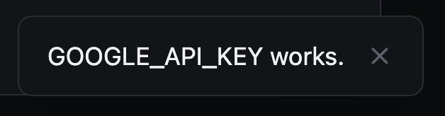

# Needed & Verified

Two things set the store apart from a plain list of keys: it knows which keys the app depends on, and it checks each key with its provider before keeping it.

## Needed or optional

Not every unset key is a problem. Groq, Mistral and Cohere are providers you could add, not gaps. So each declaration says whether something enabled actually reads it, decided by config rather than a hand-set flag:

| Key | Needed when |
|---|---|
| The active AI provider's key (`AI_PROVIDER`) | Always, unless the provider is keyless (Ollama, the public providers) |
| `RESEND_API_KEY`, `RESEND_FROM_EMAIL` | The comms service is installed |
| `STRIPE_SECRET_KEY` | The payment service is installed |
| `PLAID_CLIENT_ID`, `PLAID_SECRET` | The finance service has Plaid enabled |
| Twilio, OAuth, Porkbun, SnapTrade, `HF_TOKEN`, the insights tokens, the other AI providers, `STRIPE_WEBHOOK_SECRET` | Never: these are choices |

An unset needed key reads **Missing**, and an unset optional one **Not used**. Both Overseers lead with a count like "1 of 2 needed keys set". The health check turns amber only for a missing needed key, and names it.

## Checked when you paste

A key with a provider check gets one cheap, authenticated call before it is stored:

| Key | The call |
|---|---|
| OpenAI, Groq, Mistral, Cohere, Anthropic, Google | List models |
| OpenRouter | Read the key's own details |
| `RESEND_API_KEY` | List domains; a send-only key counts as working |
| `STRIPE_SECRET_KEY` | Read the balance; a restricted key counts as working |
| `TWILIO_AUTH_TOKEN` | Fetch the account, using `TWILIO_ACCOUNT_SID` |
| `RESEND_FROM_EMAIL` | Its domain must be a verified domain in the Resend account |
| `PLAID_SECRET` | Fetch one institution, using `PLAID_CLIENT_ID` |
| `INSIGHT_GITHUB_TOKEN` | Read the token's own user |
| `INSIGHT_PLAUSIBLE_API_KEY` | Realtime visitors for the first site in `INSIGHT_PLAUSIBLE_SITES` |
| `PORKBUN_API_KEY`, `PORKBUN_SECRET_KEY` | Porkbun's ping, which needs both halves of the pair |
| `HF_TOKEN` | Hugging Face's whoami |

- **Refused** (a typo, a revoked key): nothing is stored, and the save fails with which provider refused it. A bad key fails at the paste, not days later when a job first uses it.
- **Could not be asked** (the network, a timeout, a provider error): the key is stored and marked not verified.
- **Works**: stored, and the save says it was verified.

The provider's response body is never repeated, because some providers echo part of a rejected key in it. The same check runs on demand from each key's **Test** button, from `secrets test NAME` and from the API, whether the key is stored or set in `.env`.

## Picked, not typed

Some provider settings come from a list the provider already has. Where a declaration offers choices, both Overseers show them beside the field (a list on the web page, a Pick button in the Flet modal), and typing still works:

| Setting | Offers |
|---|---|
| `RESEND_FROM_EMAIL` | An address on each verified Resend domain |
| `TWILIO_PHONE_NUMBER` | The Twilio account's own numbers |
| `TWILIO_MESSAGING_SERVICE_SID` | The Twilio account's messaging services |

A provider that cannot be asked (no key yet, a send-only key) offers nothing, and the field takes typing as before.
