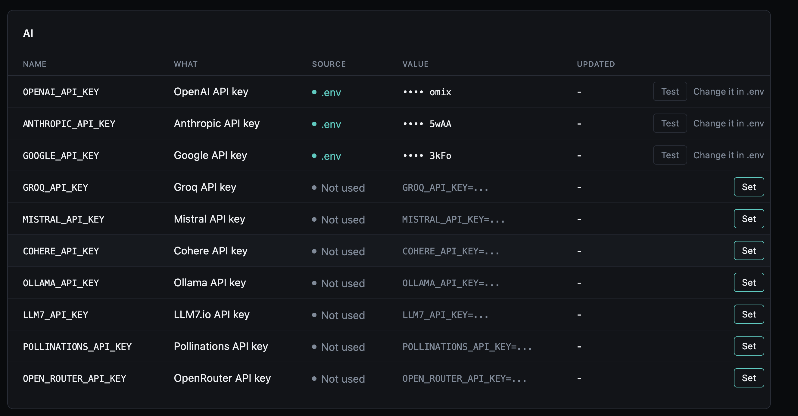
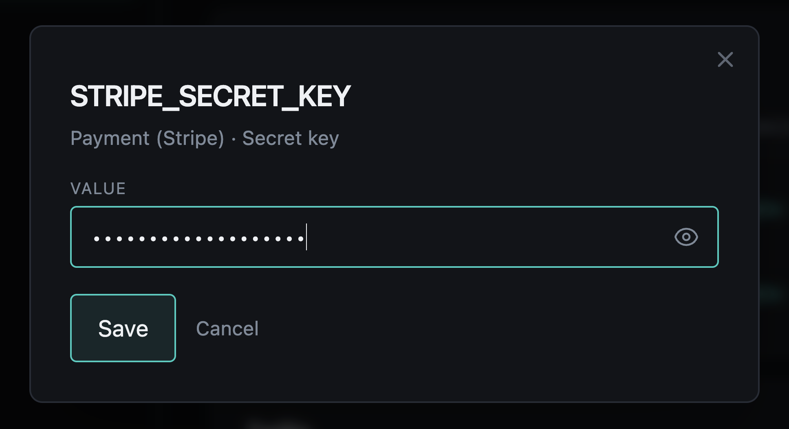
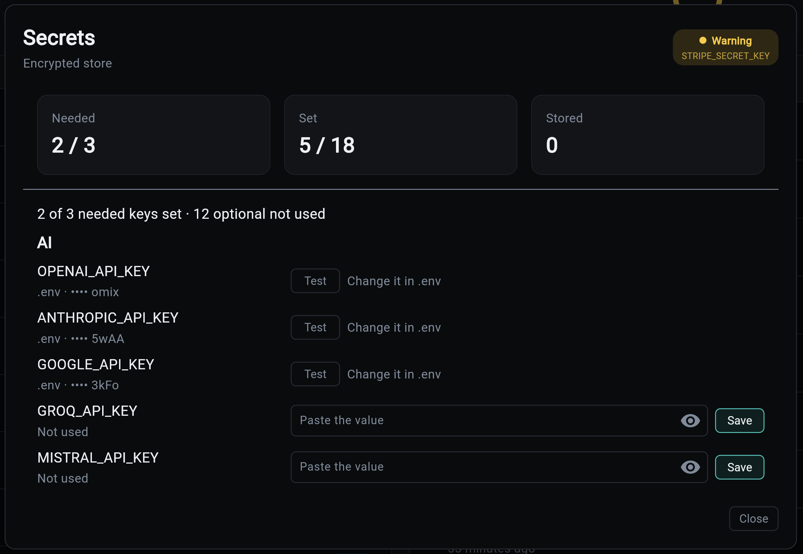

# Setting Keys

There are four ways to set a key. All of them follow the same rules (a key set in `.env` is read-only, only declared names are accepted) and run the same provider check before storing.

## Overseer

**Overseer > Secrets** lists every declared key, grouped by the code that reads it. A key not set in `.env` has **Set** (or **Replace**), which opens a dialog with an empty password field: a value goes in, and only its last four characters come back. A stored key also offers **Remove**, and any key with a check has **Test**. The Overseer is admin-only (see [Who can open the Overseer](../web-frontend/index.md#who-can-open-the-overseer)).





## Flet dashboard

The **Secrets** card shows how many needed keys are set, how many declared keys are set, and how many are stored. Its modal lists every key with a paste field, Save, Remove and Test, all through the API below.



## CLI

A value comes from a hidden prompt, or from stdin when piped, never as an argument, where it would land in shell history and the process list.

```bash
my-app secrets list                          # where each key is set, never a value
my-app secrets set RESEND_API_KEY            # hidden prompt; checked, then stored
op read "op://ops/resend/key" | my-app secrets set RESEND_API_KEY
my-app secrets test RESEND_API_KEY           # exits 1 if the provider refuses it
my-app secrets delete RESEND_API_KEY
```

## API

Admin-only, with the auth service:

| Route | Does |
|---|---|
| `GET /api/v1/secrets` | Every declared key: source, hint, needed, whether it can be checked |
| `PUT /api/v1/secrets/{name}` | Store `{"value": "..."}`; answers with the status and the check. 422 if the provider refuses it, 409 if `.env` or a read-only backend owns it, 404 for an undeclared name |
| `DELETE /api/v1/secrets/{name}` | Remove the stored value (204) |
| `POST /api/v1/secrets/{name}/test` | Check the key in effect; `result` is `verified`, `unverified` or `rejected`, with a `message` |

No route returns a value.
