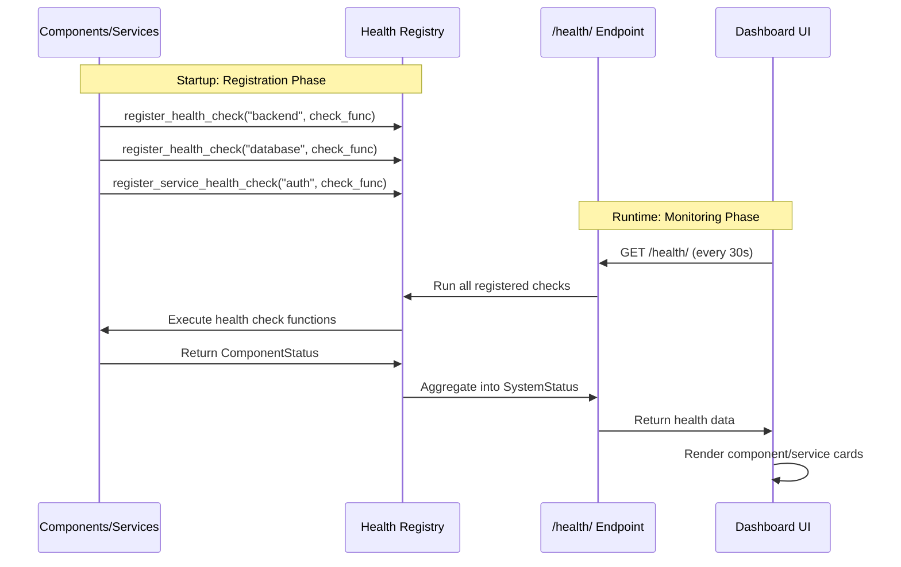

# Overseer

## Why This Exists

**Nothing is more annoying than the shrug.**

Something's broken in production. You ask what happened. You get a shrug. You ask when it started. Another shrug. You ask where the logs are. Shrug. You ask how we can fix it. The biggest fucking shrug you've ever seen.

If something is wrong, I want to know **where**, **when**, **how**, **why**, and **how can we reconcile it**. Christ! Is that too much to ask?

**It shouldn't be so fucking hard to know what happened, when, where.**

You work with Datadog until management decides to migrate to New Relic. Or you're a solo dev who just wants to see if your background jobs are running without paying enterprise prices. Overseer solves this: centralized monitoring that you own, built into every Aegis Stack project from day one.

## What It Is

**Overseer is a health monitoring dashboard** built into your Aegis Stack application. It provides real-time visibility into component and service health through a web UI.

The dashboard displays:

- **Component Cards**: Backend, Database, Worker, Scheduler health
- **Service Cards**: Auth, AI, Comms, Insights health (when included)
- **Header**: Overall health summary and theme toggle
- **Auto-refresh**: Polls health endpoint every 30 seconds

## Current Capabilities

- Component health monitoring (Backend, Database, Worker, Scheduler)
- Service health monitoring (Auth, AI, Comms, Insights)
- System metrics (CPU, memory, disk usage)
- Status hierarchy (Healthy, Warning, Unhealthy, Info)
- Web dashboard with auto-refresh (30-second polling)
- Scheduler job execution: trigger jobs manually, view execution history and stats

## Application service logs in HTMX Overseer

Open **Logs** at `/overseer/logs`. The Services checklist includes installed
application services alongside runtime components and containers. Select AI,
Auth, or several services to see their attributed logs across containers;
combined selections include any matching service or container. The same filter
applies to history, live updates, and the volume chart. Rows show the application
service alongside its runtime, for example `AI · Worker`.

Normal logs use the same automatic attribution as errors. Older lines without
attribution remain available under their runtime/container or with all filters
cleared. Logs continue to come from Docker; no additional Redis pipeline is used.

## Retained errors in HTMX Overseer

Open **Errors** beside Logs, or go directly to `/overseer/errors`. Collection runs
in the webserver background even when every browser is closed. It needs Redis
and the Docker runtime; minimal stacks still render the page with an explanation
when collection is unavailable. The existing Overseer access gate applies to
pages, fragments, and live streams.

The list groups explicit ERROR/CRITICAL messages and recognized exceptions by
service and cause. Click an issue to open the side drawer and inspect the selected occurrence, its
container, timestamp, level, safe structured fields, and stored stack trace.
Use the occurrence links to inspect older traces, or copy the selected trace.
An error without a stack trace cannot have one reconstructed from its message.
Detail URLs are bookmarkable; detail remains stable while the list updates.

The Services checklist is the one Logs uses, so a filter carries between the two
pages. No selection means every source; an error from any selected runtime,
container or application service is shown, and an application service matches its
attributed errors across containers. The Service column shows the application
service above the runtime, named as Logs names it (`Worker · system`).
Logs without service evidence remain Unattributed.
Severity, history, and search filters apply to retained occurrences
before grouping and pagination. Counts and first/last times describe the matching
retained occurrences, not lifetime error totals. Detail history shows all retained
occurrences of the issue. Search covers exception type and the first 1,024 message
characters across the retained index (up to 10,000 occurrences), not only the
current page. The Logs link opens the service's last hour of logs; stored detail
survives Docker log rotation even when those source logs are no longer available.

Live updates use independent Redis notification readers for each viewer and
replace the grouped list. A reconnect rebuilds from retained state, including
after notification trimming. Server reconciliation every 15 seconds removes
quietly expired results. An open occurrence is preserved until navigation.

## How It Works

**The Flow:**

1. **Registration**: During app startup, components and services register their health check functions with the health registry
2. **Aggregation**: The `/health/` endpoint runs all registered checks and aggregates results into a hierarchical status tree
3. **Polling**: The dashboard polls the health endpoint every 30 seconds
4. **Display**: Component and service cards render with real-time status, metrics, and details

## Health Status Indicators

Each card displays a status indicator using the Overseer status hierarchy:

| Status | Color | Visual | Meaning |
|--------|-------|--------|---------|
| **✅ Healthy** | Green | Solid green border | Component/service fully operational |
| **ℹ️ Info** | Blue | Solid blue border | Informational status, not a problem |
| **⚠️ Warning** | Yellow | Orange border | Operational but with issues |
| **❌ Unhealthy** | Red | Red border | Component/service down or failing |

**Status Propagation**: Parent components inherit the worst child status:

- Any child **Unhealthy** → Parent **Unhealthy**
- Any child **Warning** (no unhealthy) → Parent **Warning**
- Any child **Info** (no unhealthy/warning) → Parent **Info**
- All children **Healthy** → Parent **Healthy**

## The Story

Want to know how this came to be?

**[Read the full story →](story.md)** - How Overseer evolved from solving real production problems to becoming part of Aegis Stack.

## Next Steps

- **[Running Jobs](../components/scheduler/running-jobs.md)** - Trigger scheduler jobs manually, view execution history
- **[The Overseer Story](story.md)** - Evolution from Streamlit to Aegis Stack and vision
- **[Integration Guide](integration.md)** - Add health checks to custom components/services
