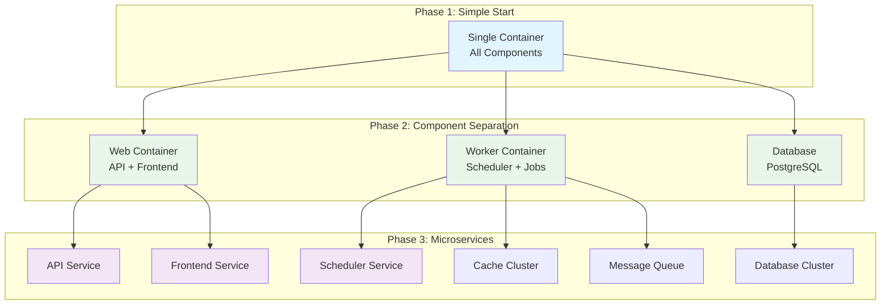

# Aegis Stack Philosophy

Aegis Stack believes in **choice over convention** - build exactly the application you need, nothing more, nothing less.

Built on three pillars: **Speed**, **Simplicity**, and **Scalability**.

## Speed: For Builders Who Refuse to Wait

Development should be fast. Aegis Stack gets you from idea to production quickly.

- **CLI-Driven Generation:** `aegis init` creates a working application in seconds
- **Async-First:** Built with `asyncio` for high-concurrency workloads
- **Full-Stack Python:** Single language for your entire stack
- **Minimalist by Default:** No unnecessary bloat or framework overhead

## Simplicity: Powerful Patterns, Not Prescriptive Frameworks

Aegis Stack favors clear, Pythonic patterns over complex, magical frameworks.

- **Transparent Integration:** Components expose capabilities through simple, documented interfaces
- **Clear Separation:** Components (capabilities), services (business logic), entrypoints (execution modes)
- **Predictable Structure:** Every project follows the same organizational patterns
- **Explicit Dependencies:** Import what you need where you need it

### Component Composition: Build Exactly What You Need

Aegis Stack rejects "one-size-fits-all" frameworks. Instead, compose exactly the capabilities your application requires.

```bash
# Simple API service
aegis init api-service

# Background processing system
aegis init processor --components scheduler

# Full application (future)
aegis init webapp --components scheduler,database,cache
```

**Components are capabilities, not implementations.** When you choose "scheduler," you're choosing the *capability* to run background tasks. The current implementation uses APScheduler.

**No unused dependencies.** Your `pyproject.toml` only includes what you actually use. Choose scheduler? You get APScheduler. Skip the database? No SQLAlchemy cluttering your environment.

**Container-native deployment.** Each component runs in its own Docker container, enabling you to scale the parts of your application that need it most.

## Scalability: Container-Native Growth

Start simple, scale smart as your application grows. Components run in separate Docker containers from day one, enabling resource optimization, independent scaling, and fault isolation.



## The Aegis Stack Promise

**Choose your components.** Get exactly the capabilities you need.  
**Start simple.** Deploy as a single application.  
**Scale smart.** Distribute components as your needs grow.  
**Stay in control.** No vendor lock-in, no framework magic, just clear Python patterns.

Aegis Stack doesn't make architectural decisions for you - it provides the tools to make them yourself.