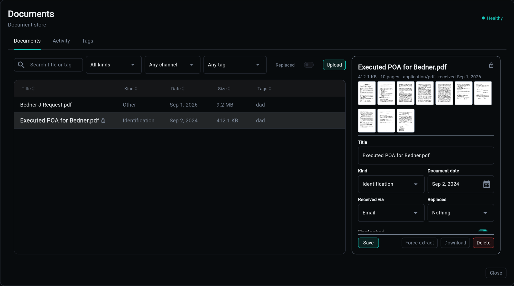
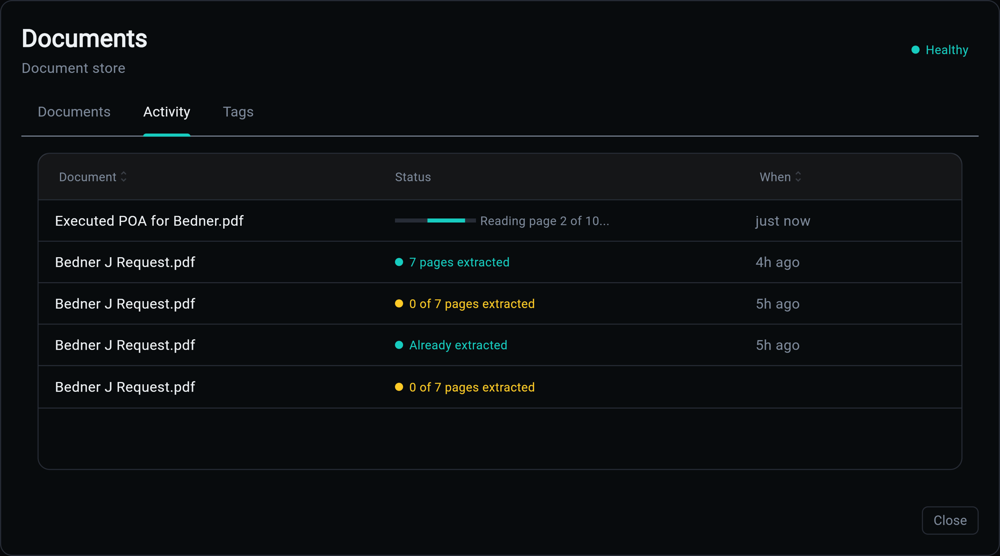
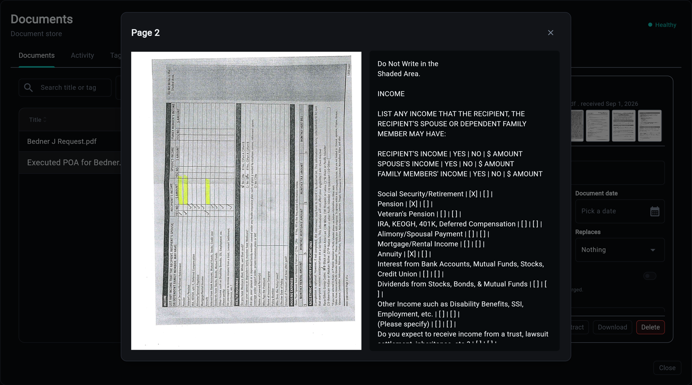

# Overseer Dashboard

Paper arrives faster than anyone files it, and the moment a document is somewhere other than where you look for it, it may as well be lost. The Documents modal is one place to put it, find it, read what is in it, and watch it being read.

## Documents

The table is everything stored, newest first: title, kind, date, size and tags, with a lock beside anything protected. Above it, the filters you actually reach for - search across title and tag, and a filter each for kind, channel and tag - plus a **Replaced** toggle, because a renewal that superseded last year's letter is noise until you go looking for it. Upload is one button, and re-uploading bytes already stored returns the document that holds them rather than a second copy.

Selecting a row opens the detail pane. It leads with what the file is - size, page count, media type, when it arrived - then the page thumbnails, then the fields worth editing in place: title, kind, document date, how it was received, what it replaces, and whether it is protected. Save is the primary action; the rest of the footer is what you do to the document itself.

A third tab, **Tags**, is the whole set with counts. Tags are free-form on purpose - what counts as a category differs per application - and seeing them together is what stops `medicaid`, `Medicaid` and `medicaid-2026` living on three documents that belong together.

The extract button says what it will do. While a page is unread it reads those; once every page has been read it becomes **Force extract**, so a run that would skip everything is never one careless click away, and re-reading after changing models still is.

## Activity

Extraction takes as long as it takes, so it does not hold the page that started it. Every run gets a row here, live: a bar and the worker's own words while it reads (`Reading page 2 of 10...`), then what it read, then how long ago. Several extractions at once are several rows moving, off one event stream rather than one poll per document.

The colour is the honest part. A run that read every page is the house accent; one that left pages unread is amber, however cleanly the job itself finished. `0 of 7 pages extracted` is what a text-only model looks like from here, and it is not a success. `Already extracted` is the third case: a run that had nothing to do.

A job nobody has picked up reads `Queued`, and `Waiting` once it has sat longer than a worker should take, rather than animating a bar at you. The bar means a worker is reporting progress, and nothing else.

## Page Viewer

A thumbnail opens the page at full size with its transcript beside it: the scan on the left exactly as it was scanned, what extraction read on the right, selectable.

The transcript is a transcription, not a summary. Reading order is preserved, a checkbox becomes `[X]` or `[ ]`, and a table row becomes its cells separated by `|`, so a form answers questions in the shape it asked them. That is what makes the text worth storing: a claim built on it later can quote the page rather than paraphrase it.

A page that could not be read says why here rather than showing an empty column.

---

The modal reads the documents API and the generic jobs feed; nothing here talks to storage or the worker directly. See the [API Reference](api.md) for the routes and [Extraction](extraction.md) for what the statuses mean.
