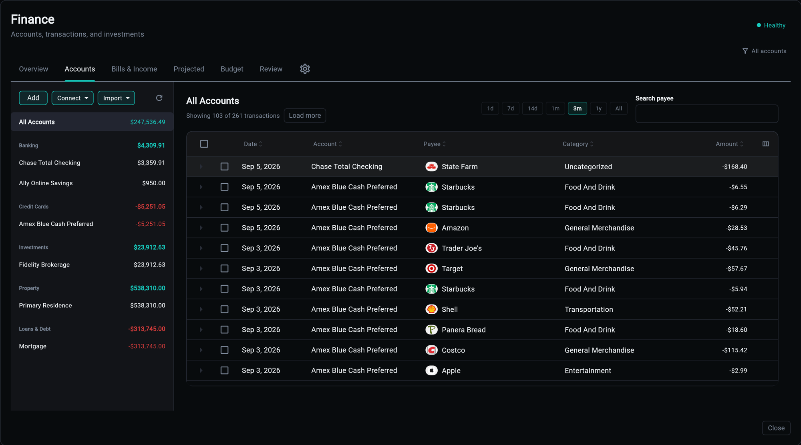

# Accounts and the Register

The recorded past: what you hold, what you owe, and every movement between them. This is the `ledger` domain and the **Accounts** tab that shows it.

## Accounts

An account is a balance with a type and a classification. The type decides how it behaves; the classification decides which side of net worth it lands on.

Four types count as **cash**: `checking`, `savings`, `cash`, `money_market`. That set is shared by the balance projection, the liquidity rules and the analyst snapshot, so "cash on hand" means the same thing on every surface that says it.

Accounts come from three places, and they mix freely:

- **Manual** - typed in, carrying a balance you update or a valuation series you record. A house is an account.
- **Imported** - created by a file import when the statement names an account the ledger does not have.
- **Connected** - opened by a provider connection and refreshed on sync.

Balances follow one display rule: the authoritative `current_balance` when a real balance write happened, otherwise the sum of the register. One rule, shared by the projection walk and the budget outlook, so "today's balance" can never mean two things on two tabs.

### Liabilities and Properties

A liability balance is negative. A credit card carries its terms in a `liability` detail row when the source reports them, which is what lets the projection know a statement balance from a minimum payment.

A property is an account with a valuation series rather than a balance: each `finance_valuation` row is a point in time, and net worth reads the latest. An account can also be marked as *secured by* another, which is how a mortgage knows which house it is against.

## The Register

Transactions are the fact table. Three properties are worth knowing before anything else:

**Amounts are sign-normalized integer cents.** Negative is an outflow. `raw_amount` keeps whatever the provider actually delivered, so normalization is never lossy.

**Re-importing is safe.** Every row carries a dedupe identity: a stable provider id where one exists, a content hash where it does not. Importing an overlapping statement twice does not double your spending, and the overlap is detected rather than guessed at.

**Rows link to each other.** Self-referencing keys thread a pending charge to the posted one that replaced it, a duplicate to its canonical row, one side of a transfer to the other, and a reversal to what it reversed. A transfer is two rows that know about each other, not one row with a special type, which is why transfers can be excluded from spending without deleting anything.

### Splits

A split carves one purchase into category lines: *"$25 of the Target run was food"*.

The parent row is never touched. Its amount, category, payee and import identity stay exactly as recorded, so re-imports still dedupe and account math still balances. The split adds child rows and flips a flag, and category reporting swaps the parent for its lines.

Parts arrive as positive magnitudes, because that is what you actually know, and any unclaimed difference becomes a remainder line under the parent's own category automatically. You state the parts you are sure of; the ledger keeps the rest honest.

### Tags

Tags are the label axis **orthogonal** to categories. A row keeps its natural category (Software, Meals) and wears tags like `Business` on top.

Without them, "what did my business cost" forces a parallel tree of business-flavoured categories, and every transaction has to pick a side. With them, one lens rolls up without disturbing the other.

## Payees

The name on a statement is not the name of who you paid. `SQ *COFFEE 4155551` and `Hudson Valley Grounded` may be the same merchant.

A merchant row is the curated name; transactions point at it. Merchants can be **merged**, which reassigns every transaction from one to the other, and **payee groups** collect several merchants under one heading for reporting.

The **No payee** sub-tab in Review exists because a transaction with no merchant is invisible to every payee-shaped question, and the fix is one assignment rather than a rule.

## Categories

Categories are a tree with **aliases**: the names a source app uses map onto yours, so a Quicken import does not arrive as a second parallel taxonomy.

"Uncategorized" is deliberately not just a null check. A row is uncategorized either by having no category at all, or by carrying one of the names a source app uses to mean it did not classify: `uncategorized`, `unclassified`, `other income`, `misc`, `miscellaneous`. Checking only for null reports zero uncategorized on a Quicken import that has over a thousand of them.

## Net Worth Over Time

History cannot be derived after the fact, so snapshots start on day one.

The snapshot engine materializes a per-account-per-day row and a per-user-per-day row, which turns the net-worth chart into an indexed range scan rather than a recompute. It reads balances and valuations only, never transactions: manual accounts follow their valuation series, and accounts with only a current balance carry that value forward. The job is bounded to a 35-day window by default so it never scans deep history.

Backfill or repair the series with `finance recompute-snapshots`; see [CLI Commands](cli.md).

## Related

| Topic | Description |
|-------|-------------|
| [Importing and Connections](imports.md) | where transactions come from |
| [Review](review.md) | uncategorized rows, missing payees |
| [API Reference](api.md) | the accounts and register endpoints |
