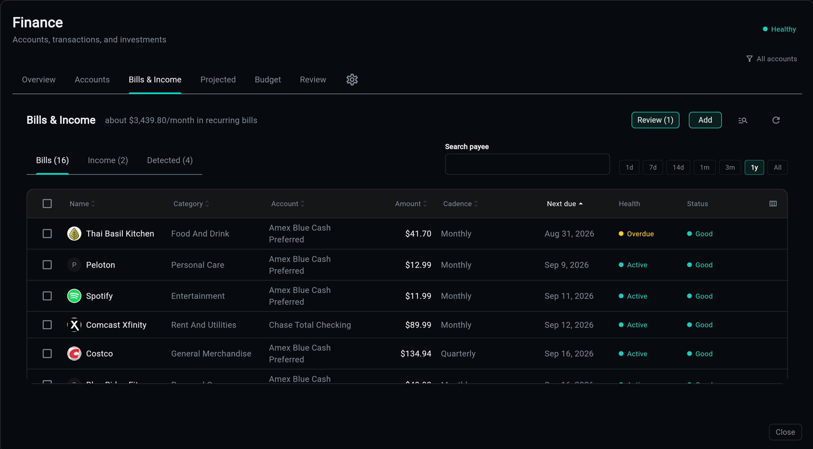

# Bills and Income

The **Bills & Income** tab is the standing obligations: rent, the paycheck, the subscriptions, the annual premium. Most of them are found in your history rather than typed in.

## Detection Proposes; You Confirm

The detector reads your transactions, finds rhythms, and files each one as a *proposal*. A proposal counts for nothing until you confirm it.

That gate is load-bearing. Before it existed, the header read "$23,575 fixed this month from 97 detected bills" about rows nobody had ever looked at, and the app nagged about missed payments for bills the user had never acknowledged having. A stream is part of the record when it was created by you or confirmed by you, and only then does it reach the forecast, the monthly-cost headline, the Budget tab's Fixed bucket, or the missed-payment nag.

Confirm is the one door in.

## Cadences

A measured median gap is matched against a table of bands, shortest first, so where two bands touch the shorter cadence takes the overlap.

| Cadence | Gap | Monthly equivalent | Grace |
|---------|-----|--------------------|-------|
| Weekly | 7d | 52/12 | 3d |
| Every 2 weeks | 14d | 26/12 | 3d |
| Twice a month | 15d | 2 | 5d |
| Monthly | 30d | 1 | 5d |
| Every 2 months | 60d | 0.5 | 5d |
| Quarterly | 90d | 1/3 | 5d |
| Every 6 months | 180d | 1/6 | 5d |
| Yearly | 365d | 1/12 | 5d |

Short cadences get a tighter grace window, because a weekly charge four days late is meaningful and a monthly one is not.

**`irregular` and `unknown` are deliberately not cadences.** A stream stores them when nothing fits or there has only ever been one occurrence. They can be stored, but they cannot be stepped, offered in a menu, or weighed in a rollup, which is exactly the difference the table encodes.

`once` is a real frequency with no next occurrence: a one-time bill, which the forecast still carries while it is unpaid.

## Declaring One Yourself

The other door into the same tables: select rows in the register and say *these are a bill*.

Detection infers a stream from a rhythm it found; declaring states one from rows you picked, which means the cadence may be thin and the amounts may not match. A declared bill and a detected one are the same kind of row, and you see what will happen before anything is written.

## The Verbs on a Stream

| Verb | Meaning |
|------|---------|
| **Confirm** | this is real; it now counts everywhere |
| **Pause until** | a stated fact, not an inference: "skip my investments for a few months" without losing the bill |
| **Mute** | out of the forecast and the headline for good, without deleting the history |
| **Attach** | this payment paid that bill |
| **Categorize** | set the category every future occurrence inherits |

Pause is lazy by design: nothing un-sets it, so "until Nov 1" means active again on Nov 1 by pure comparison, with no scheduler job to run and nothing to go wrong while the app is off.

## Matching a Payment to a Bill

A bill is not paid because a similar-looking charge exists. Matching is explicit, and the candidates are ranked.

`bill_candidates(stream_id)` returns unclaimed payments scored by the same heuristic the app's own match picker uses, and everything that proposes a match, including the chat assistant, proposes *from that shortlist*. If a payment is not in it, the honest answer is that it is not there, not a guess that looks close.

The **Review queue** collects streams that need a decision: detected but unconfirmed, or overdue with no payment attached.

## What Reaches the Forecast

A stream is in the forecast when all of these hold:

- it is confirmed (or you created it)
- it is not muted
- it is not paused as of the date being asked about
- it has an expected amount and a next expected date
- its cadence is one the walk can step

Transfers are excluded from the bills figure: a card payment and the swipes it settles are the same money seen twice, and the budget already counts the swipes.

## Related

| Topic | Description |
|-------|-------------|
| [Projected Balances](projected.md) | what the confirmed streams do to your balance |
| [Budget](budget.md) | the Fixed bucket, and why bills win where they overlap |
| [Review](review.md) | the queue of streams awaiting a decision |
