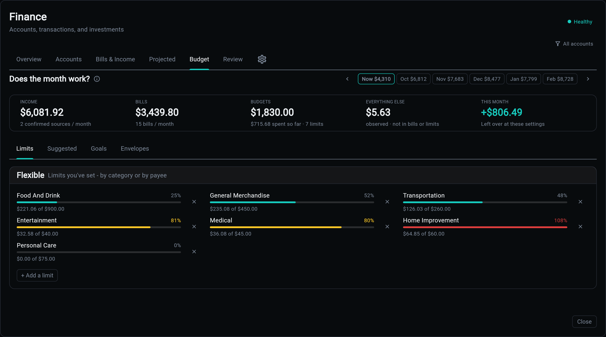

# Budget

The **Budget** tab is the plan: what you intend to spend, against what is already committed, against what is actually happening.

## Four Buckets

A month is presented in four groups, because they are four different kinds of obligation:

| Bucket | What it holds |
|--------|---------------|
| **Fixed** | monthly bills, shown at face value. Not a limit you set: what it costs |
| **Non-monthly** | the annual premium, the quarterly tax. Shown so a big month is not a surprise |
| **One-time** | a one-off with a date attached, at face value rather than a monthly average |
| **Flexible** | the envelopes you chose: groceries, restaurants, fuel |

Only the Flexible bucket is a *limit*. The other three report what is already spoken for, which is why a bill can never read as "over budget" on itself.

## A Budget Is a Standing Decision

Allocations are keyed by a period, so without a rule every month would open empty and the only way back would be typing the whole thing in again.

A month with no envelopes of its own **inherits** the last month that had them: amounts only, never spend. The moment a month has any envelope of its own it is a month you have decided about, and inheritance stops touching it.

Every surface reads a period's plan through the same call, so the projection, the month strip and the Budget tab cannot disagree about which envelopes are in force.

## The Month Ahead

The outlook runs the header's own equation forward, one month at a time, with bills at face value on their real cadence. That is the point of it: the month the annual premium lands looks like that month rather than like an average. "Fine this month, broke in October" is visible from one page.

Underneath the rates it carries a **level**: today's real cash, compounded through each month's net. A healthy rate starting from an empty account still reads red where it should.

## Everything Else

Not all spending has an envelope. The uncovered-spend rate is what your habits cost that no plan covers, computed from recent months and shown as its own row so the total is honest rather than flattering.

Clicking any header figure opens its detail: the rows behind the number, filtered exactly the way the cell was.

## Suggestions

The service proposes envelopes from what you actually spend, skipping categories a recurring bill already covers, since those are counted in Fixed. Suggestions can be dismissed, and a dismissal is remembered rather than re-offered every month.

## Envelopes and Goals

Both are accounts wearing metadata rather than new tables.

An **envelope** is a running balance living inside real cash: an allowance a kid draws down, a house-repairs pot. Money moves both directions and there is no finish line. Envelopes can auto-credit on a cadence.

A **goal** is either virtual (a hidden account whose assigned-so-far is its own dated history) or linked (a real account you already have, whose contributions are its own transfers). Goals have a target and a monthly contribution, and both feed the projection.

## Related

| Topic | Description |
|-------|-------------|
| [Projected Balances](projected.md) | what the envelopes do to the balance line |
| [Bills and Income](bills.md) | the Fixed and Non-monthly buckets |
| [Review](review.md) | the transactions the budget is counting |
