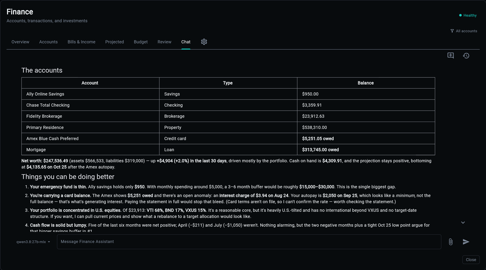
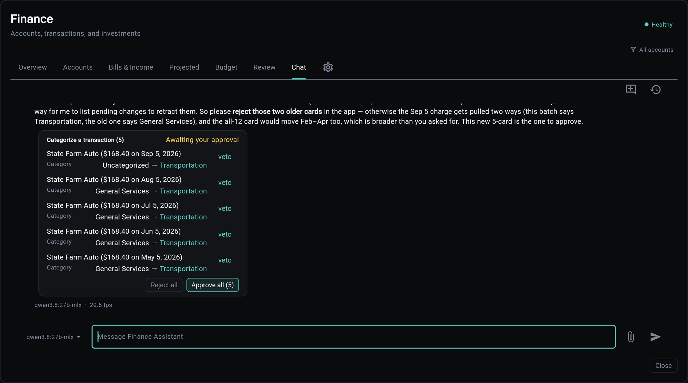

# Finance Chat

A conversation with your own ledger. The Finance modal's **Chat** tab embeds a chat panel bound to one agent row, `finance-assistant`, whose tools read your accounts, transactions, envelopes, goals and holdings directly.

The design rule that shapes everything below: **the model does not do arithmetic, and the model cannot write to your ledger.** Numbers are computed in a sandbox from real rows. Changes are filed as proposals you approve in the app.



## Why Not Just Ask a Model

A language model asked "how much did I spend at the coffee place last month" will produce a number. The number will look right. Nothing about the way it was produced makes it right, and there is no way to tell from the answer which kind you got.

So the assistant is not asked to know your figures. It is asked to fetch them and compute:

```
you ──▶ chat panel ──▶ /api/v1/ai/chat/stream ──▶ agent
                                                   │
                             snapshot briefing ◀────┤  (context, every turn)
                                                   │
                                    run_code ◀─────┤  (sandbox: fetch, compute, print)
                                        │          │
                                 finance tools     │
                                        │          │
                                   your database   │
                                                   ▼
                                              the answer
```

Everything the answer asserts numerically came out of the last box up from the bottom.

## The Two Halves of the Context

**A snapshot, every turn.** The `finance_snapshot` memory module is fetched into context before the agent sees your message: balances, the net-worth trend, credit card and loan detail, portfolio positions, monthly cashflow, category spend against its norm, recent transactions, open anomalies, the cash forecast, and what is due next. It exists so the assistant opens a conversation already knowing your situation rather than spending three turns discovering it.

**Tools, on demand.** The snapshot is a briefing, not the ledger. Anything specific comes from a tool call.

| Tool | Answers |
|------|---------|
| `accounts()` | balances, cash on hand, net worth, debt owed, envelopes, goals, holdings |
| `ledger(months=N)` | the income, spend and net trend by month |
| `ledger(months=N, detail="transactions")` | line items: merchants, categories, subscriptions |
| `categories()` | the category ids a proposal payload needs |
| `bills()` | live recurring streams |
| `bill_candidates(stream_id)` | the ranked shortlist of unclaimed payments for one bill |
| `tags()` | the tag directory, so spellings are reused rather than coined |
| `quote(ticker)` | a stored price |

Liability balances are negative, and every money value a tool returns is integer cents.

## Computed, Not Estimated

The agent runs with `code_mode` on. A question needing arithmetic becomes a script executed in a sandbox that has the finance tools in scope: fetch what is needed, compute, print the figures. The transcript shows the call, so the work is visible rather than asserted.

This is why "can I afford it", "what is my runway", "how much do I spend on subscriptions" and "what did I spend at X" get exact answers, and why the assistant says what is missing when the data genuinely cannot answer instead of producing a plausible number.

The sandbox is not a REPL. Each call carries a complete script, and a typical answer is one call, because state persists across calls within a turn and re-fetching data already held is waste.

## It Proposes; You Decide

The assistant has exactly one ledger write, and it does not write. `propose(change_type, payload)` files a **pending change**: a card under the reply with **Approve** and **Reject** buttons. Nothing in your ledger moves until you press one.



The card is the decision point, and it is yours. Five recategorisations arrive as one card: every row has its own **veto**, the batch has **Approve all** and **Reject all**, and until you press something the ledger is exactly as it was. The assistant can argue for the change in the reply above the card, as it does here, but it cannot make it.

Registered change types:

| Change type | What it does |
|-------------|--------------|
| `transaction.categorize` | files a transaction under a category |
| `transaction.assign_payee` | names who a transaction was really with |
| `transaction.tag` / `transaction.untag` | the label axis orthogonal to categories |
| `transaction.split` | carves one purchase into category lines |
| `recurring.match` | records which payment paid which bill |

Three rules make the queue usable rather than a chore:

- **Many changes, one card.** "Categorize all the uncategorized ones" is a `propose_many` batch: one card, a per-row veto, and an approve-all. Not forty cards.
- **The assistant cleans up after itself.** A card filed by mistake, or one superseded by a narrower request, is retracted with `withdraw_batch` (or `withdraw` for a single row) and a reason, without asking you to reject it. A withdrawn card folds to **withdrawn**, not rejected, because it was never your no.
- **Cards come back on request.** "What happened to the State Farm card?" calls `pending(about="state farm")`, which lists the assistant's own cards, open and recently decided, and redraws each one under the reply in its current state. Rejected and withdrawn cards fold to a one-line outcome and expand on demand. The assistant points at the cards; it does not retype their rows.
- **Matches come from the shortlist.** `recurring.match` takes its transaction id from `bill_candidates(stream_id)`, which ranks unclaimed payments with the same heuristic the app's own match picker uses. If the payment is not in the shortlist, the assistant says so rather than proposing a lookalike.

Money movement is not on this list, and is not planned for it. The queue changes how transactions are *described*, never what they are.

## Receipts and Screenshots

Attach an image of an order or receipt and the assistant reads the line items, groups them by category, and proposes a single `transaction.split` against the parent transaction it finds in your ledger.

Two details worth knowing, because they explain what you will see:

**Totals are not forced to match.** Tax, discounts and promos mean a screenshot rarely sums to the charge. The assistant claims only the item subtotals it can see; the remainder stays under the transaction's own category as its own line. A split that balanced perfectly every time would be one that invented numbers to make it balance.

**An attached image lasts one turn.** The bytes are ephemeral. Before answering from an image, the assistant calls `record_reading` with every line item, and that recording is what later turns get instead of the pixels. Ask a follow-up two messages later and it is answering from the recorded reading, not from a memory of an image it can no longer see.

## What It Remembers

Tool data is re-readable, so it is never saved: it would only go stale. What gets saved is what you *state* and nothing else knows.

> "The house is worth about $711,200 as of this August."

That is a durable fact about your money that no connection reports, so it is written to memory in the same turn, third-person, quoting your figure, with its provenance marked as your estimate. A saved number is not an appraisal, and the memory says so.

Facts the assistant inferred, computed, or read from a tool are not saved. Neither is anything that is only useful for today's question.

## Configuration

The tab appears only in builds that selected the `ai` service, which the finance service reports through its status metadata. Without the AI service there is no chat API to speak to, so the tab is absent rather than broken.

Everything about the agent lives in its database row and is editable from the AI dashboard without a redeploy:

| Field | Default | Notes |
|-------|---------|-------|
| `slug` | `finance-assistant` | what the tab binds to |
| `model_id` | unset | follows whatever model the AI service is configured with |
| `temperature` | `0.4` | warmer than the analyst's restatement work |
| `max_tokens` | `4000` | a chat answer plus the code-mode loop |
| `code_mode` | on | arithmetic is computed, not estimated |
| `memory_modules` | `finance_snapshot` | the briefing above |

Seeding is idempotent and never overwrites a row that already exists, so an edited prompt survives a re-seed. Tool attachment is additive by name; a tool row that is missing is skipped with a warning rather than breaking the tab.

## The Panel Itself

The chat panel is a shared control, not a finance one. It talks to `/api/v1/ai/chat/stream` and `/api/v1/ai/conversations` over HTTP and never reaches into a service in-process, so what the finance tab exercises is the same path an external client would use.

Conversations are tagged with the surface they started on. The history drawer in the finance tab lists finance conversations, not every conversation in the app.

## Related

| Topic | Description |
|-------|-------------|
| [AI Agents](../ai/agents.md) | agent rows, tools, and the dashboard that edits them |
| [Memory Modules](../ai/memory-modules.md) | how the snapshot is fetched into context |
