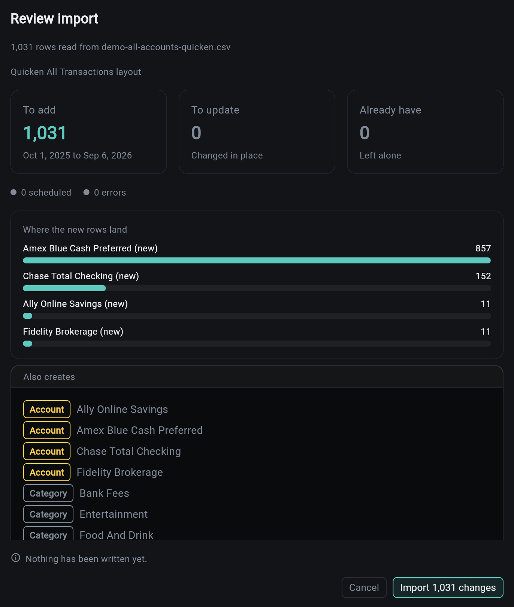

# Importing and Connections

Two ways to get data in. Neither is required to use the service, and file import needs no third-party anything.

## Files

| Format | Notes |
|--------|-------|
| **CSV** | profile-driven: a source's column shape is a profile, not a code change |
| **OFX / QFX** | the bank download format |
| **QIF** | Quicken's older export |

Import is a two-step: **preview** shows what would happen (how many rows are new, how many are already there, which accounts and categories would be created) and only then does the import run. A Quicken tree can carry hundreds of new categories, and seeing that before it lands is the difference between an import and a mess.

A bank or card statement names no account, so the import asks which account it belongs to before previewing, and the review names both the detected layout and the target: "Chase Credit Card layout into Amex". A statement aimed at the wrong account is caught there, not in the register afterwards. Multi-account exports (Quicken) route themselves by the account column.

Every import is a **batch**. The batch keeps its rows, so you can look at what a given file actually did rather than reasoning backwards from the register.

Re-importing is safe by design. Rows carry a dedupe identity, so an overlapping statement does not double your spending.

## Connections

Provider links ship behind their own flags, and the service works fully without them.

| Provider | Covers |
|----------|--------|
| **Plaid** | banks and cards |
| **SnapTrade** | brokerages |

A connection syncs on a schedule and on demand. Connections that need attention (an expired link, a re-authentication) are reported by the service health check and surfaced in the dashboard, because a silently stale connection is worse than an obviously broken one.

!!! note "Plaid is sandbox-only here"
    The template is wired and tested against Plaid's sandbox. Production credentials are yours to supply.

## Demo Data

`finance seed-demo` fills a project with a plausible ledger: accounts, a spending history, bills, a budget. It is the fastest way to see every tab populated, and it clears cleanly. See [CLI Commands](cli.md).

## Related

| Topic | Description |
|-------|-------------|
| [Accounts and the Register](accounts.md) | where imported rows land |
| [Investments](investments.md) | custodian activity files |
| [CLI Commands](cli.md) | `import`, `sync`, `seed-demo` |
