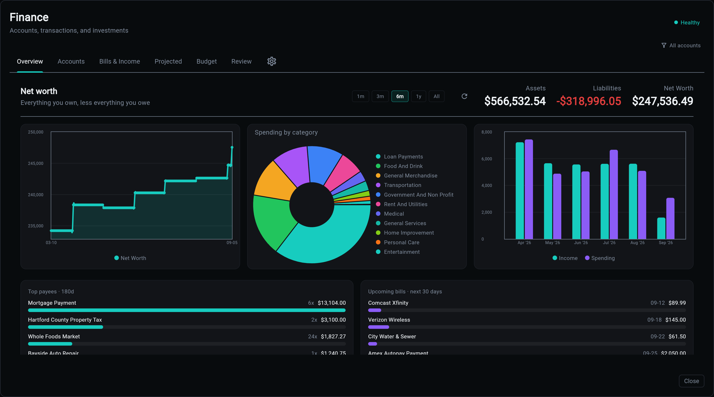

# Finance Service

!!! warning "Experimental"
    Schema, APIs, and CLI surface may change between releases.

A personal finance ledger: accounts and their balances, transactions and what they were for, the bills that repeat, a budget, goals, and holdings. It aggregates from files and provider connections, and everything it concludes is computed from rows you can inspect.



!!! info "Quick Start"
    ```bash
    aegis init my-app --services finance
    cd my-app
    uv sync
    make serve
    ```

    Finance requires the `backend`, `database` and `scheduler` components, and recommends `worker`. File import and manual accounts work with no third-party service at all; provider connections ride behind their own flags.

## What You Get

- **A ledger that survives re-import** - transactions carry a dedupe identity, so importing an overlapping statement twice does not double your spending.
- **Recurring detection** - the bills and paychecks in your history are found rather than typed in, then confirmed by you. What is detected feeds the forecast; what you mute does not.
- **A forecast** - today's cash walked forward through the bills, budget envelopes and goal contributions that are actually scheduled. Overdue money lands on today rather than disappearing.
- **A budget that is a standing decision** - envelopes are keyed by period, and a new month inherits the last one you set rather than opening empty.
- **A proposal queue** - the chat assistant and the rules can suggest changes to how a transaction is described. Nothing is applied until you approve it, and money movement is never proposed.
- **Investments** - holdings, trades, and stored prices, with net worth carried across both cash and positions.
- **An Overseer surface** - a Finance card and a modal with seven tabs, covered page by page below.
- **A health check** - account and transaction counts, snapshot freshness, and which provider connections need attention.

## The Shape of It

The service is organised by what a thing *is*, not by which page shows it:

```
app/services/finance/
├── service/            the entry point: one facade over the domains
├── domains/
│   ├── ledger/         accounts, transactions, categories, merchants,
│   │                   splits, tags, net worth, properties, valuations
│   ├── planning/       budgets, envelopes, goals, allocation, recurring
│   │                   streams and the projection walk
│   ├── detection/      what the data implies: recurring rhythms,
│   │                   transfers, insight rules, the analyst
│   ├── investments/    securities, holdings, trades, prices
│   └── writes/         the proposal queue: registry, executors, curation
├── adapters/
│   ├── importers/      CSV, OFX/QFX, Quicken, investment profiles
│   └── providers/      Plaid, SnapTrade
├── models/             the tables
└── schemas/            what the API returns
```

A caller reaches every verb through the service facade. Nothing outside a domain imports its internals.

## The Pages

| Page | What it covers |
|------|----------------|
| [Accounts and the Register](accounts.md) | accounts, balances, transactions, splits, tags, payees, categories |
| [Bills and Income](bills.md) | recurring detection, confirming a stream, matching a payment |
| [Projected Balances](projected.md) | the forward walk, and the rules that decide what lands when |
| [Budget](budget.md) | envelopes, the period rule, the outlook, suggestions |
| [Review](review.md) | approvals, uncategorized, no payee, attention |
| [Investments](investments.md) | holdings, trades, prices, net worth |
| [Importing and Connections](imports.md) | files, batches, Plaid and SnapTrade |
| [Chat](chat.md) | the conversational assistant, and what it refuses to do |
| [API Reference](api.md) | the endpoints, grouped by sub-router |
| [CLI Commands](cli.md) | status, import, sync, demo data |

## Ownership

Standalone finance is single-user: rows are owned by an unscoped owner id. When the `auth` service is present, a migration wires the owner foreign key to the app user, and every query is scoped by it. Finance does not require auth, so selecting finance alone does not drag an authentication system in with it.

## Money, Dates, and Other House Rules

These hold everywhere in the service, and knowing them makes every other page shorter:

- **Money is integer cents.** No floats anywhere in the ledger, the API, or the tools.
- **Outflows are negative.** A liability balance is negative; a payment reduces what you owe.
- **Periods are `YYYYMM` integers.** Budget lines are keyed by period, not by date range.
- **`today` is a parameter.** Every forward-looking call takes the date it is asked about rather than reading the clock, which is what makes "what did this look like last month" answerable.
- **A row with no account survives an account filter.** A hand-entered bill belongs to no account, so narrowing to one says nothing about it.
