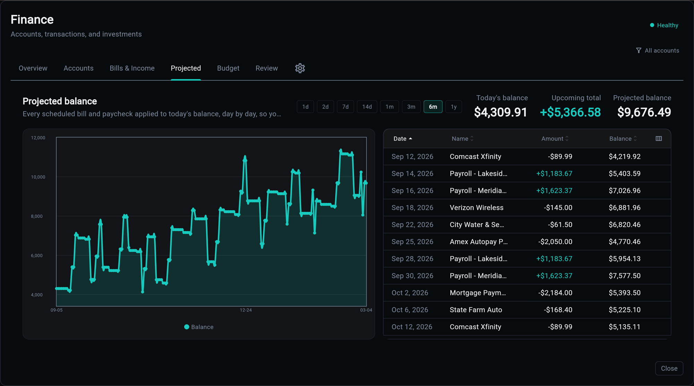

# Projected Balances

The **Projected** tab answers one question: if nothing changes, what does the balance look like from here?

It is a walk, not a model. Today's cash is stepped forward through what is actually scheduled, and every point on the chart traces back to a row you can open.

## Where It Starts

The starting balance is your **cash** accounts (`checking`, `savings`, `cash`, `money_market`), using the same balance rule the sidebar uses, so the projection cannot begin from a number the rest of the app disagrees with.

The dialog's account filter reaches the walk. A balance line that moves through bills on accounts you are not looking at moves for reasons that are off screen.

## What Lands on the Line

Three things drain or feed the same timeline, and the interleaving is the point: a running balance is only true if the draws land in the order money actually moves.

| Source | When it lands |
|--------|---------------|
| Bills and income | on their real due dates, at face value |
| Budget envelopes | once a month, as what is *left* of the envelope |
| Goal contributions | monthly, on the 1st |

Only confirmed commitments project. Detected-but-unconfirmed rhythms would fabricate both a five-figure decline and an equally fictional windfall, so they stay out until you confirm them.

## Three Behaviours Worth Knowing

**Overdue money still counts.** A bill that went past due is money you still owe, so it lands on today rather than disappearing. The row shows the date it was actually due, because "today" on a three-week-late bill hides the one thing worth seeing about it.

**Bills win where they overlap.** A category a recurring bill already pays is spending the forecast has counted once. Adding the budget envelope on top would charge it twice.

**Envelopes draw what is left.** Money already spent has left the account and is in the starting balance. An overage carries into the next month as a tightened envelope, and the line says so rather than appearing as an unexplained smaller number.

## One Schedule, Every Surface

"When does this stream move money" is answered once, and both the projection and the Budget tab's month-ahead strip consume that answer. They used to have their own loops, which drifted: overdue money was missing from the month strip entirely while the projection beside it showed the bill.

The same holds for the account filter and for reading a month's budget. One rule each, so two tabs cannot disagree about the same month.

## Related

| Topic | Description |
|-------|-------------|
| [Bills and Income](bills.md) | what qualifies as a commitment |
| [Budget](budget.md) | envelopes, and the period they belong to |
| [Chat](chat.md) | asking "can I afford it" against the same data |
