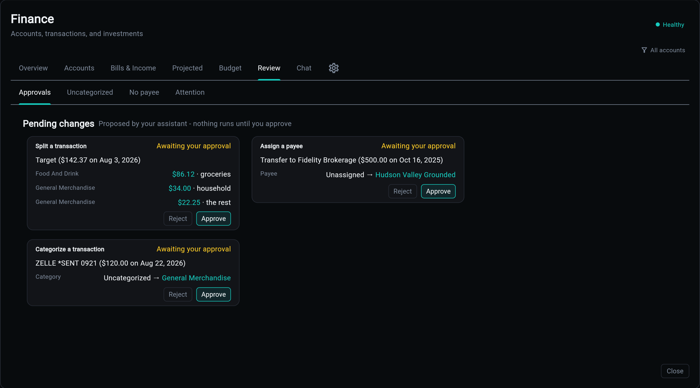
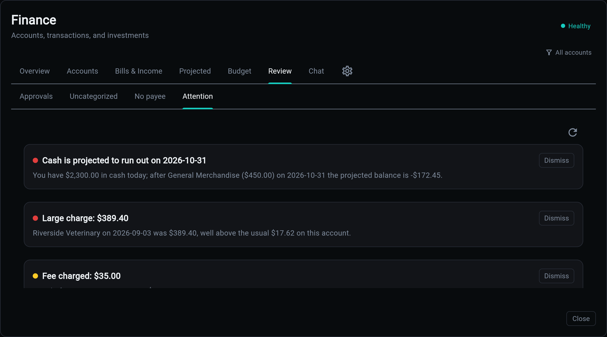

# Review

The **Review** tab is everything waiting on a decision, in four sub-tabs. It is the tab you clear rather than the tab you read.

## Approvals

The proposal queue. A change is *filed* here, not applied: you approve or reject it, and until you do, nothing in the ledger has moved.

Anything that wants to change how a transaction is described goes through this queue, including the [chat assistant](chat.md). Registered change types:

| Change type | What it does |
|-------------|--------------|
| `transaction.categorize` | files a transaction under a category |
| `transaction.assign_payee` | names who a transaction was really with |
| `transaction.tag` / `transaction.untag` | adds or removes a tag |
| `transaction.split` | carves one purchase into category lines |
| `recurring.match` | records which payment paid which bill |

Related changes arrive as one batch: a single card with a per-row veto and an approve-all, rather than forty separate cards. A proposer can also withdraw its own still-pending card, so a mistake does not become your cleanup.

**Money movement is not a change type, and is not planned as one.** The queue changes how transactions are described, never what they are.

Adding a change type means adding an executor. One that is never imported does not exist to the queue, which keeps the registered set honest.

## Uncategorized

Transactions with no category, or with one of the placeholder names a source app uses to mean it did not classify. Categorizing here is one click, and rules can pick up the pattern for next time.

## No Payee

A transaction with no merchant is invisible to every payee-shaped question, and it cannot be matched to a bill. This sub-tab is that backlog.

## Attention

The findings. A set of deterministic rules runs nightly and writes rows:

| Rule | Fires when |
|------|-----------|
| `price_hike` | a fixed recurring charge went up |
| `fee_charged` | a fee or interest charge hit an account |
| `overspend_category` | a category is well above its recent norm |
| `large_transaction` | one charge is far outside its account's norm |
| `missed_recurring` | a mature bill's charge never showed up |
| `card_overdue` | the institution reports a credit account past due |
| `min_payment_gap` | a minimum payment due soon exceeds cash on hand |
| `high_apr_carry` | a balance is accruing expensive interest |
| `credit_utilization` | a card is close to its limit |
| `cash_runway` | scheduled bills walk the balance below zero |
| `subscription_creep` | the subscription total drifted above its norm |

Two properties matter more than the list itself.

**The rules are deterministic.** Thresholds are constants tuned by test, not a config surface to fiddle with. The same data produces the same findings.

**Nothing invents a finding.** Everything that displays these rows consumes findings it did not make. A model can narrate an alert; it can never conjure one.

Findings dedupe, so the same alert is not regenerated every night, and they can be dismissed.

## Related

| Topic | Description |
|-------|-------------|
| [Chat](chat.md) | where most proposals come from |
| [Bills and Income](bills.md) | the streams awaiting confirmation |
