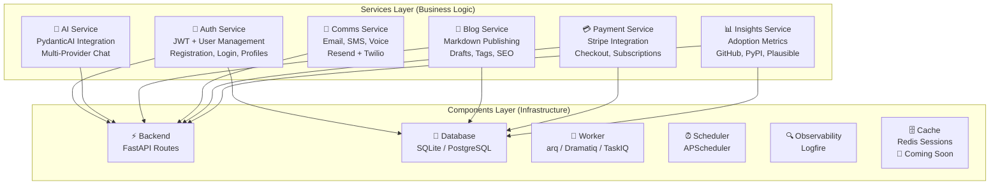
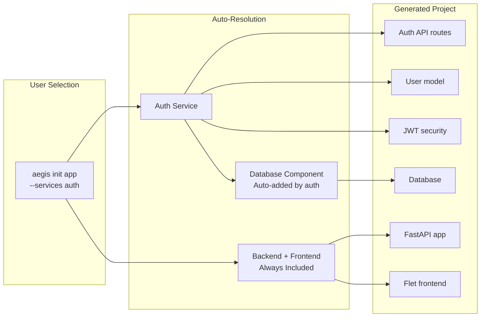
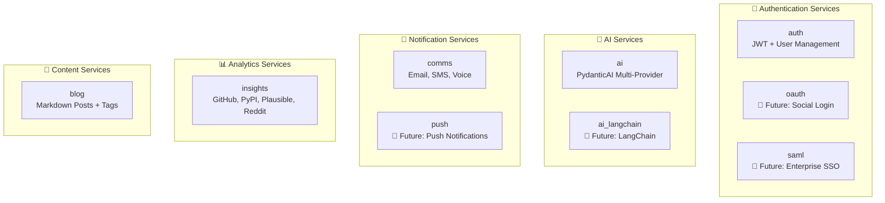
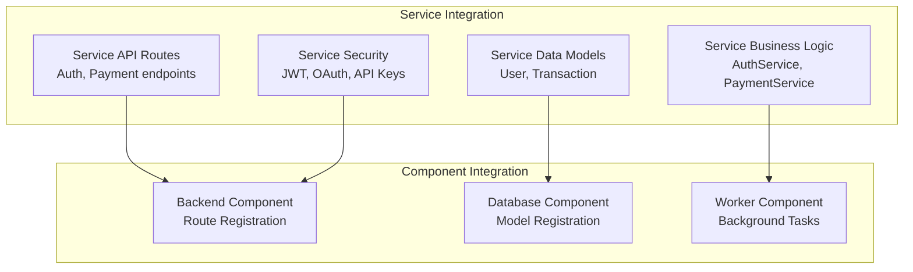

# Services Overview

Services are **business-level functionality** that your application provides to users. While Components handle infrastructure concerns (databases, workers, scheduling), Services implement specific business capabilities like authentication, payments, or AI integrations.

!!! info "Services vs Components"
    **Services** = What your app does (auth, AI, insights)
    **Components** = How your app works (database, workers, API)

## Service Architecture



!!! tip "Architectural Guidance"
    This page covers **which services are available** and how to add them to your project. For detailed patterns on **how services integrate with components** and how to structure your code, see **[Integration Patterns](../integration-patterns.md)**.

## Service Selection

Services are chosen during project creation and automatically include their required components:

```bash
# Basic API project (no services)
aegis init my-api

# Interactive mode - must explicitly specify required components
aegis init user-app --services auth --components database
# Required: must include database component that auth service needs

# Non-interactive mode - must explicitly specify all components
aegis init user-app --services auth --components database --no-interactive
# Required: must include database component that auth service needs

# Multiple services with explicit components (future)
aegis init full-app --services auth,ai --components database,worker --no-interactive
# Required: must include all components that services need
```

## Dependency Resolution

**Interactive Mode:** Services automatically include required components.

**Non-Interactive Mode:** You must explicitly specify all required components when using `--components`.



## Service Categories



## Service Development Patterns

### Service Structure

Every service follows one layout, so the file you want is where you expect it
whoever wrote the service. Names are positional - the file says what it *is*,
not what it is called:

| File | Holds |
|------|-------|
| `service.py` | the facade: the entry point callers reach for |
| `models.py` | the service's tables |
| `schemas.py` | request and response shapes |
| `queries.py` | every read, batched; no business logic |
| `deps.py` | the request-scoped wiring |
| `health.py` | what the dashboard shows |
| `jobs.py` | all background jobs |
| `constants.py`, `utils.py` | shared values and helpers |

A service grows into that layout in three steps, and stops at whichever one
still fits: a small service keeps its logic in `service.py`; a larger one puts
each subsystem in a package under `domains/`.

```
app/services/
├── documents/               # a spine, plus one domain
│   ├── service.py models.py queries.py health.py deps.py
│   └── domains/
│       └── extraction/      # pages.py pdf.py vision.py dispatch.py jobs.py
│
└── finance/                 # several domains, each its own package
    ├── service/ models/ schemas/ health.py jobs.py utils.py
    └── domains/
        ├── ledger/          # each with its own queries.py
        ├── planning/
        └── detection/
```

Domains are plural nouns with no `_service` suffix, and their functions take
the session first (`async def create_budget(db, ...)`). Everything a caller
outside the service needs reaches it through `service.py`; the domain packages
are how the service is organised, not its public surface.

The `__init__.py` docstring is the domain map. It is the first thing anyone
reads - a person opening the package or a coding agent deciding where a change
belongs - so it names each domain and what it owns.

!!! tip "The layout is tested, not just described"
    Behavioural tests cannot see a layout: a service works the same whether it
    is one flat package or four small ones. Finance and documents each carry a
    `test_*_module_layout.py` stating which module defines what, so folding a
    domain back together, or dropping a function into whichever file was open,
    fails a test rather than passing quietly.

!!! note "Services written before the standard"
    `auth`, `blog` and `insights` still carry `<name>_service.py` names from
    before this was settled. They work exactly as they always did; they are
    moved onto the layout when there is a reason to be in them, not in a
    sweep for its own sake.

### Service Integration Points



## CLI Commands

### List Available Services
```bash
aegis services
```

Shows all available services by category with their dependencies:

```
AVAILABLE SERVICES
========================================

Authentication Services
----------------------------------------
  auth         - User authentication and authorization with JWT tokens
               Requires components: backend, database

Payment Services
----------------------------------------
  payment      - Payment processing with Stripe (checkout, subscriptions, webhooks)
               Requires components: backend, database

AI & Machine Learning Services
----------------------------------------
  No services available yet.
```

### Create Project with Services
```bash
# With specific services - must include required components
aegis init my-app --services auth --components database

# Interactive service selection
aegis init my-app --interactive

# Multiple services (future)
aegis init full-app --services auth,ai --components database,worker
```

## Dashboard Integration

Services automatically appear in the health dashboard alongside components, providing real-time monitoring of your business capabilities. See **[Overseer](../overseer/index.md)** for dashboard documentation.

---

**Next Steps:**

- **[Integration Patterns](../integration-patterns.md)** - How services integrate with components and architectural patterns
- **[AI Service](ai/index.md)** - Multi-provider chat, database-driven agent registry, memory modules, RAG, sentiment analytics
- **[Authentication Service](auth/index.md)** - Complete JWT auth implementation
- **[Blog Service](blog/index.md)** - Markdown publishing with drafts, tags, and Overseer editor *(experimental)*
- **[Communications Service](comms/index.md)** - Email, SMS, and voice via Resend/Twilio
- **[Documents Service](documents/index.md)** - Content-addressed document store with page-addressed extraction
- **[Insights Service](insights/index.md)** - Adoption metrics tracking (GitHub, PyPI, Plausible, Reddit) *(experimental)*
- **[Payment Service](payment/index.md)** - Payment processing with Stripe *(experimental)*
- **[CLI Reference](../cli-reference.md)** - Service command reference
- **[Components Overview](../components/index.md)** - Infrastructure layer
